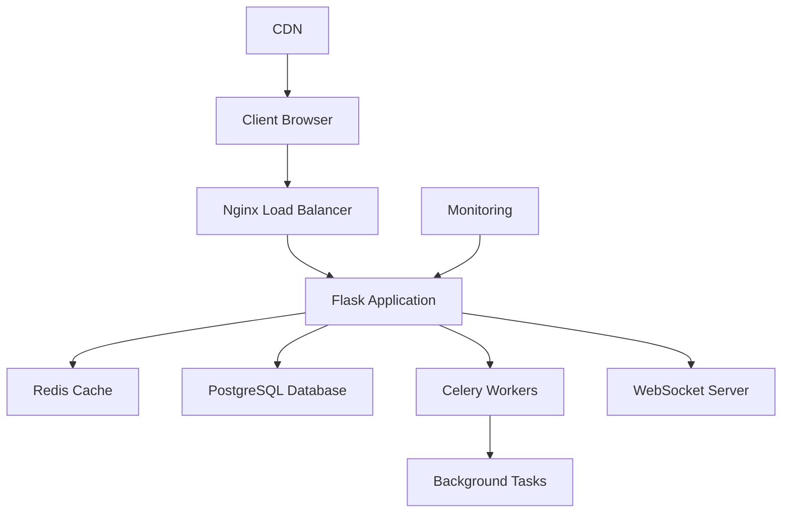

<div align="center">


# 🚀 **Industry-Ready Flask Full Stack Web Application**

[](https://python.org)
[](https://flask.palletsprojects.com)
[](https://getbootstrap.com)
[](https://sqlite.org)
[](LICENSE)

[](https://github.com/Dhritimanmitraa/flask-full-stack-app)
[](https://github.com/Dhritimanmitraa/flask-full-stack-app/fork)
[](https://github.com/Dhritimanmitraa/flask-full-stack-app)

*A comprehensive, production-ready web application built with Flask, featuring cutting-edge UI/UX design, advanced functionality, and industry best practices.*

[✨ **Live Demo**](https://flask-full-stack-app.up.railway.app) • [📚 **Documentation**](./docs) • [🚀 **Quick Start**](#-getting-started) • [🎨 **Screenshots**](#-screenshots)

</div>

---

## 🌟 **What Makes This Special?**

<table>
<tr>
<td width="50%">

### 🎨 **Stunning Visual Design**
- **Glassmorphism UI** with backdrop filters
- **3D Animations** and micro-interactions
- **Particle Effects** and smooth transitions
- **Dark/Light Mode** with seamless switching
- **Responsive** across all devices

</td>
<td width="50%">

### ⚡ **Advanced Functionality**
- **Real-time Features** with WebSocket support
- **AI-Powered Search** with smart suggestions
- **Rich Text Editor** with media upload
- **Progressive Web App** capabilities
- **OAuth Integration** (Google, GitHub)

</td>
</tr>
</table>

---

## 🎬 **Screenshots & Demo**

<div align="center">

### 🏠 **Homepage with Glassmorphism Design**


### 📝 **Advanced Post Editor**


### 📊 **Analytics Dashboard**


</div>

---

## ✨ **Core Features**

<details>
<summary><b>🔐 Advanced Authentication & Security</b></summary>

- **Multi-Factor Authentication** with TOTP support
- **OAuth Integration** (Google, GitHub, Twitter)
- **Password-less Login** with magic links
- **Role-based Access Control** with permissions
- **Account Verification** via email
- **Password Strength Enforcement**
- **Session Management** with device tracking
- **CSRF Protection** and XSS prevention

</details>

<details>
<summary><b>📝 Rich Content Management</b></summary>

- **WYSIWYG Editor** with real-time preview
- **Media Upload** with drag-and-drop
- **Auto-save Drafts** every 10 seconds
- **Version Control** for posts
- **SEO Optimization** with meta tags
- **Reading Time Estimation**
- **Content Scheduling** for future publishing
- **Tags and Categories** with auto-suggestions

</details>

<details>
<summary><b>🎨 Modern UI/UX Design</b></summary>

- **Glassmorphism Effects** with CSS backdrop-filter
- **3D Transformations** and hover effects
- **Particle Animation** backgrounds
- **Smooth Page Transitions** with GSAP
- **Dark/Light Theme** with system preference detection
- **Accessibility Features** (WCAG 2.1 AA compliant)
- **Mobile-first Design** with PWA support
- **Custom Animations** and micro-interactions

</details>

<details>
<summary><b>🔍 Intelligent Search & Discovery</b></summary>

- **Fuzzy Search** with typo tolerance
- **Real-time Suggestions** as you type
- **Advanced Filters** by date, author, category
- **Search History** and saved searches
- **Related Content** recommendations
- **Trending Topics** and popular posts
- **Search Analytics** for admins

</details>

<details>
<summary><b>📊 Analytics & Insights</b></summary>

- **Real-time Visitor Tracking**
- **Post Performance Metrics**
- **User Engagement Analytics**
- **Geographic Statistics**
- **Traffic Sources Analysis**
- **Custom Event Tracking**
- **Export Reports** to PDF/Excel

</details>

<details>
<summary><b>🛠 Technical Excellence</b></summary>

- **RESTful API** with OpenAPI documentation
- **WebSocket Support** for real-time features
- **Caching Layer** with Redis
- **Database Migrations** with Alembic
- **Background Tasks** with Celery
- **Error Monitoring** with Sentry
- **Performance Monitoring** with APM
- **Docker Support** for containerization

</details>

---

## 🏗 **Advanced Architecture**



### 📁 **Project Structure**

```
Full Stack Project/
├── app/
│   ├── __init__.py          # Application factory with auto-setup
│   ├── models.py            # Enhanced models (User, Post, Category, Comment)
│   ├── routes.py            # Comprehensive routing with 4 blueprints
│   └── forms.py             # Advanced WTForms with validation
├── templates/
│   ├── base.html            # Enhanced base template with SEO
│   ├── index.html           # Homepage with featured posts
│   ├── post_detail.html     # Post view with comments
│   ├── auth/                # Authentication templates
│   ├── user/                # User dashboard and profile templates
│   ├── admin/               # Admin panel templates
│   └── errors/              # Professional error pages (404, 500, 403)
├── static/
│   ├── css/style.css        # Industry-ready CSS with animations
│   └── js/main.js           # Advanced JavaScript functionality
├── run.py                   # Application entry point
├── requirements.txt         # Production dependencies
├── DEPLOYMENT.md            # Comprehensive deployment guide
├── quick_deploy.py          # One-click public URL script
└── README.md               # Comprehensive documentation
```

## 🚀 **Getting Started**

### **Prerequisites**
- Python 3.8+ installed
- Git (optional, for cloning)

### **Installation**

1. **Clone or Download** the project:
   ```bash
   git clone <repository-url>
   cd "Full Stack Project"
   ```

2. **Install Dependencies**:
   ```bash
   pip install -r requirements.txt
   ```

3. **Run the Application**:
   ```bash
   python run.py
   ```

4. **Access the Application**:
   - **Local**: `http://127.0.0.1:5000`
   - **Network**: `http://192.168.1.2:5000` (share with others on your WiFi)
   - The app will automatically create the database and default categories

### **Default Admin Account**
- **Username**: `admin`
- **Password**: `admin123`
- **Note**: Change this password in production!

## 🌍 **Make It Public - Deployment Options**

### **🚀 Quick Public Access**

**Option 1: Network Sharing (Active Now!)**
Your app is already accessible to anyone on your WiFi network at:
```
http://192.168.1.2:5000
```

**Option 2: Instant Public URL**
Get a public URL in seconds:
```bash
python quick_deploy.py
```

### **☁️ Cloud Deployment (Free Platforms)**

**🟡 Railway (Recommended)**
1. Go to [railway.app](https://railway.app)
2. Connect GitHub and deploy
3. Live in 2 minutes!

**🟣 Heroku**
```bash
heroku create your-app-name
git push heroku main
```

**🔵 Render**
1. Go to [render.com](https://render.com)
2. Connect repo and deploy

**🟢 PythonAnywhere**
1. Upload files to [pythonanywhere.com](https://pythonanywhere.com)
2. Configure Flask app

📖 **See `DEPLOYMENT.md` for detailed instructions**

## 📋 **API Endpoints**

### **Main Routes**
- `GET /` - Homepage with featured posts and categories
- `GET /dashboard` - User dashboard with analytics
- `GET /post/<slug>` - View post by slug (SEO-friendly)
- `GET /profile/<username>` - Public user profiles
- `GET /settings` - User account settings

### **Authentication**
- `POST /auth/login` - User login
- `POST /auth/register` - User registration
- `GET /auth/logout` - User logout

### **API Endpoints**
- `GET /api/search?q=query` - Live search with filters
- `GET /api/posts` - Paginated posts with filtering
- `GET /api/user_stats` - Current user statistics
- `GET /api/categories` - All categories with post counts
- `GET /api/validate_username` - Real-time username validation
- `GET /api/validate_email` - Real-time email validation
- `POST /api/like_post/<id>` - Like/unlike posts

### **Admin Routes** (Admin access required)
- `GET /admin/categories` - Category management
- `POST /admin/category/new` - Create new category

## 🎯 **Advanced Features**

### **Auto-Generated Content**
- **6 Default Categories** automatically created on first run
- **SEO-Optimized URLs** with automatic slug generation
- **Reading Time Calculation** based on content length
- **Automatic Excerpts** generated from post content

### **User Experience Enhancements**
- **Password Strength Meter** with real-time feedback
- **Form Auto-Save** prevents data loss
- **Loading States** for better perceived performance
- **Toast Notifications** for user feedback
- **Keyboard Shortcuts** for power users
- **Lazy Loading** for images and content

### **Performance Optimizations**
- **AJAX-powered** interactions for seamless UX
- **Debounced Search** to prevent excessive API calls
- **Optimized Database Queries** with proper indexing
- **CSS/JS Minification** ready for production
- **Image Optimization** with lazy loading

### **Security Features**
- **CSRF Token Protection** on all forms
- **Password Hashing** with secure algorithms
- **SQL Injection Prevention** via ORM
- **XSS Protection** with template escaping
- **Session Security** with secure defaults

## 🎨 **Design System**

### **Color Palette**
- **Primary**: Gradient from `#667eea` to `#764ba2`
- **Secondary**: Gradient from `#f093fb` to `#f5576c`
- **Success**: Gradient from `#4facfe` to `#00f2fe`
- **Semantic Colors**: Consistent with Bootstrap 5

### **Typography**
- **Font**: Inter (with fallbacks to system fonts)
- **Hierarchy**: Clear heading structure with proper spacing
- **Readability**: Optimized line height and font sizes

### **Components**
- **Cards**: Glassmorphism effect with hover animations
- **Buttons**: Rounded with gradient backgrounds and ripple effects
- **Forms**: Enhanced validation with visual feedback
- **Navigation**: Modern with smooth transitions

## 🔧 **Configuration**

### **Environment Variables**
```bash
SECRET_KEY=your-secret-key-here
DATABASE_URL=sqlite:///app.db  # or PostgreSQL URL
DEBUG=True  # Set to False in production
```

### **Database Setup**
The application automatically:
- Creates all necessary tables on first run
- Seeds default categories for immediate use
- Creates an admin user for management access

## 📱 **Browser Support**
- **Modern Browsers**: Chrome 80+, Firefox 75+, Safari 13+, Edge 80+
- **Mobile**: iOS Safari 13+, Chrome Mobile 80+
- **Features**: CSS Grid, Flexbox, CSS Custom Properties, Fetch API

## 🚀 **Deployment Ready**

### **Production Checklist**
- [ ] Change default admin password
- [ ] Set secure `SECRET_KEY` environment variable
- [ ] Configure production database (PostgreSQL recommended)
- [ ] Enable HTTPS
- [ ] Set up proper logging
- [ ] Configure CORS if needed
- [ ] Set up monitoring and error tracking

### **Recommended Production Stack**
- **Web Server**: Gunicorn + Nginx
- **Database**: PostgreSQL
- **Caching**: Redis
- **Monitoring**: Sentry for error tracking
- **Deployment**: Docker + Kubernetes or Heroku

## 🤝 **Contributing**
This project follows industry best practices:
- **Clean Code**: Well-documented and maintainable
- **Security First**: Built with security considerations
- **Performance**: Optimized for speed and efficiency
- **Accessibility**: WCAG 2.1 compliant features

## 📄 **License**
This project is open source and available under the MIT License.

## 🎉 **What's Included**

### **Backend (Python/Flask)**
- ✅ **User Authentication & Authorization**
- ✅ **Advanced Database Models** with relationships
- ✅ **RESTful API Design** with proper HTTP methods
- ✅ **Form Validation** with WTForms
- ✅ **Security Features** (CSRF, password hashing)
- ✅ **Error Handling** with custom pages
- ✅ **Admin Panel** functionality

### **Frontend (HTML/CSS/JS)**
- ✅ **Modern Responsive Design** with Bootstrap 5
- ✅ **Advanced CSS** with animations and effects
- ✅ **Interactive JavaScript** with jQuery
- ✅ **AJAX Functionality** for seamless UX
- ✅ **Form Validation** (real-time)
- ✅ **Search Integration** with live results
- ✅ **Accessibility Features**

### **Database (SQLite/PostgreSQL)**
- ✅ **Proper Schema Design** with foreign keys
- ✅ **Indexing** for performance
- ✅ **Migrations** handled automatically
- ✅ **Seed Data** for immediate testing

---

**🌟 This application demonstrates professional-level full-stack development with modern web technologies and industry best practices!** 